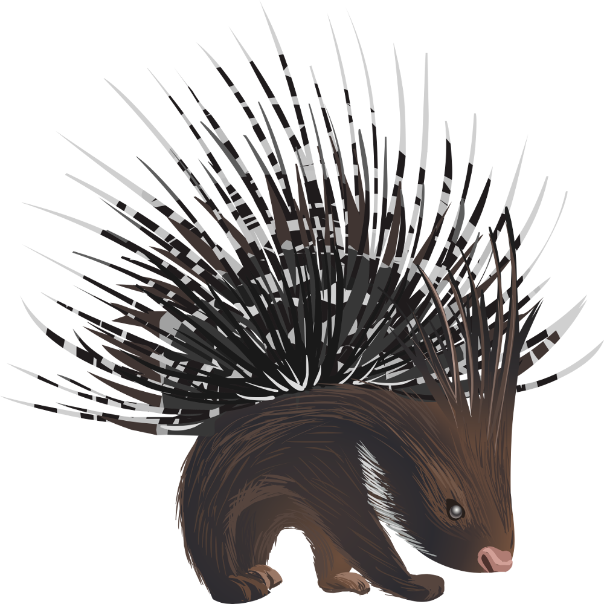

# PORCUPINE 
**P**rincipal Components Analysis to **O**btain **R**egulatory **C**ontributions **U**sing **P**athway-based Interpretation of **N**etwork **E**stimates is an R package to identify biological pathway which drive inter-tumour heterogeneity in a population of gene regulatory networks. It is a Principal Components Analysis (PCA)-based approach that can be used to determine whether a specific set of variables—for example a set of genes in a specific pathway—have coordinated variability in their regulation.

## Method
PORCUPINE uses as input individual patient networks, for example networks modeled using PANDA and LIONESS, as well as a .gmt file that includes biological pathways and the genes belonging to them. For each pathway, it extracts all edges connected to the genes belonging to that pathway and scales each edge across individuals. It then performs a PCA analysis on these edge weights, as well as on a null background that is based on random pathways. To identify significant pathways, PORCUPINE applies a one-tailed t-test and calculates the effect size (ES). 
Here we provide example how we analysed heterogeneity among single gene regulatory sample networks in Leiomyosarcomas (LMS). Networks were obtained with PANDA and LIONESS algorithms. Our  dataset contains data for 80 TCGA LMS patient-specific gene regulatory networks. 

## Usage

```{r}
library(remotes)
install_github('kuijjerlab/PORCUPINE')
library("PORCUPINE")

```
For this analysis, we need to load the following packages:
```{r}
require("data.table")
require("fgsea")
require("dplyr")
require("plyr")
require("purrr")
require("stats")
require("parallel")
require("lsr")
require("ggplot2")
require("gridExtra")
require(cowplot)

```
First, we load the network data. Network file can be quite big and it might take time to read it in.
In this example, we have patient-specific gene regulatory networks for 80 TCGA leiomyosarcoma patients.
The first three columns in the data provide information on the regulators (TFs) and target genes. 

```{r}
load(file.path(data_dir, "80_tcga_lms_net.RData"), net <- new.env())
net <- net[["net"]]
net[1:5, 1:5]

#   0E244FE2-7C17-4642-A51F-2CCA796D9C70 75435ED8-93E8-45FB-8480-98D8EB2EF8CB
# 1                                 0.76                                 0.10
# 2                                 0.94                                 1.43
# 3                                 1.09                                 2.78
# 4                                 1.13                                 2.60
# 5                                -0.71                                -1.42
#   B6D11678-15A9-4F43-A0A2-225067DCAF1C B7F5A41E-9559-4329-81F5-1B88A74730B7
# 1                                -1.27                                 0.01
# 2                                 0.30                                 0.91
# 3                                 1.01                                 2.13
# 4                                 1.66                                 1.71
# 5                                 0.02                                 0.27
#   04823F53-A12D-4852-8F34-77B9DCBB7DF0
# 1                                -7.18
# 2                                -5.69
# 3                                -6.09
# 4                                -6.04
# 5                                 5.31

```
Now we load in the edges information. This includes three columns: reg (the transcription factor's gene symbol),
tar (Ensembl ID), prior (whether an edge is prior (1) or not (0)).

```{r}
load(file.path(data_dir, "edges.RData"), edges <- new.env())
edges <- edges[["edges"]]
head(edges)
#     reg  tar prior
# 1  AIRE A1BG     0
# 2  ALX1 A1BG     0
# 3  ALX3 A1BG     0
# 4  ALX4 A1BG     0
# 5    AR A1BG     0
# 6 ARID2 A1BG     0

length(unique(edges$reg))
# [1] 623
length(unique(edges$tar))
# [1] 17899

```
Our individual networks are represented by interactions between 623 TFs and 17,899 target genes.
Then, we need to load in pathway file (.gmt file). Gmt files can be downloaded from http://www.gsea-msigdb.org/gsea/msigdb/collections.jsp
```{r}
pathways <- load_gmt(file.path(data_dir, "c2.cp.reactome.v7.1.symbols.gmt"))
length(pathways)
# [1] 1532
```
We need to filter pathways in order to include only pathways with genes that are present in our network file. 
```{r}
pathways <- filter_pathways(pathways, edges)
length(pathways)
# [1] 1531
```
Then, we filter pathways based on their size, and all pathways with less than 10 and more than 150 genes are filtered out. 
```{r}
pathways_to_use <- filter_pathways_size(pathways, minSize = 5, maxSize = 150)
length(pathways_to_use)
# [1] 1411
```
We select the top 10 pathways for the analysis (just to reduce computational time).
```{r}
pathways_to_use <- pathways_to_use[1:10]
```
Next, we perform PCA analysis for the 10 selected pathawys and extact the information on the variance explained by the first principal component in each pathway.
```{r}
pca_res_pathways <- pca_pathway(pathways_to_use, net, edges, ncores = 1, scale_data = TRUE, center_data = TRUE)
head(pca_res_pathways)
#                                                                    pathway
# 1                                          REACTOME_2_LTR_CIRCLE_FORMATION
# 2 REACTOME_A_TETRASACCHARIDE_LINKER_SEQUENCE_IS_REQUIRED_FOR_GAG_SYNTHESIS
# 3                                             REACTOME_ABACAVIR_METABOLISM
# 4                                REACTOME_ABACAVIR_TRANSMEMBRANE_TRANSPORT
# 5                               REACTOME_ABACAVIR_TRANSPORT_AND_METABOLISM
# 6                          REACTOME_ABC_FAMILY_PROTEINS_MEDIATED_TRANSPORT
#      pc1 n_edges pathway_size
# 1 23.705    4361            7
# 2 24.647   16198           26
# 3 19.960    3115            5
# 4 26.763    3115            5
# 5 20.052    6230           10
# 6 18.127   60431           97

```
Then we perform a PCA analysis based on random gene sets. In this case we create 50 random gene sets for each pathway and run PCA for each gene set. This is just an example, for real comparisons we recommend to set n_perm to 1000 and use multiple cores (ncores).

```{r}
pca_res_random <- pca_random(net, edges, pca_res_pathways, pathways, n_perm = 50, ncores = 1, scale_data = TRUE, center_data = TRUE)

```
Then to identify significant pathways we run PORCUPINE, which compares the observed PCA score for a pathway to a set of PCA scores of random gene sets of the same size as pathway. Calculates p-value and effect size.

```{r}
res_porcupine <- porcupine(pca_res_pathways, pca_res_random)
res_porcupine$p.adjust <- p.adjust(res_porcupine$pval, method = "fdr")
res_porcupine

#                                                                      pathway
#  1                      REACTOME_ACETYLCHOLINE_BINDING_AND_DOWNSTREAM_EVENTS
#  2    REACTOME_ABORTIVE_ELONGATION_OF_HIV_1_TRANSCRIPT_IN_THE_ABSENCE_OF_TAT
#  3                            REACTOME_ABC_TRANSPORTERS_IN_LIPID_HOMEOSTASIS
#  4                                        REACTOME_ABC_TRANSPORTER_DISORDERS
#  5                           REACTOME_ABC_FAMILY_PROTEINS_MEDIATED_TRANSPORT
#  6                                REACTOME_ABACAVIR_TRANSPORT_AND_METABOLISM
#  7                                              REACTOME_ABACAVIR_METABOLISM
#  8                                 REACTOME_ABACAVIR_TRANSMEMBRANE_TRANSPORT
#  9  REACTOME_A_TETRASACCHARIDE_LINKER_SEQUENCE_IS_REQUIRED_FOR_GAG_SYNTHESIS
#  10                                          REACTOME_2_LTR_CIRCLE_FORMATION
#     pathway_size    pc1         pval         es     p.adjust
#  1            12 19.032 9.999985e-01 0.74686646 1.000000e+00
#  2            21 20.513 8.590165e-01 0.15385053 1.000000e+00
#  3            18 21.537 1.511015e-01 0.14746050 7.555077e-01
#  4            71 18.888 7.994104e-01 0.11976698 1.000000e+00
#  5            97 18.127 9.998624e-01 0.55432949 1.000000e+00
#  6            10 20.052 9.998741e-01 0.55831709 1.000000e+00
#  7             5 19.960 1.000000e+00 1.34304387 1.000000e+00
#  8             5 26.763 6.326255e-01 0.04818923 1.000000e+00
#  9            26 24.647 4.412136e-10 1.07013419 4.412136e-09
#  10            7 23.705 7.139036e-01 0.08041887 1.000000e+00

```
Significant pathways can be selected based on adjusted p-value, explained variance and effect size. In our analysis, we used p.adjust <= 0.01, pc1 >=10 % and es >=2.

```
To obtain pathway-based patient heterogeneity scores on the first two principal component
```{r}
ind_res <- get_pathway_ind_scores(pathways_to_use, net, edges,  scale_data = TRUE)
head(ind_res)

#  $REACTOME_2_LTR_CIRCLE_FORMATION
#                                             Dim.1        Dim.2
#  0E244FE2-7C17-4642-A51F-2CCA796D9C70 -10.4024788    0.6293617
#  75435ED8-93E8-45FB-8480-98D8EB2EF8CB   0.7600518   17.1798620
#  B6D11678-15A9-4F43-A0A2-225067DCAF1C  -8.6445509   12.2459201
#  B7F5A41E-9559-4329-81F5-1B88A74730B7  -6.8707230   10.1577008
#  04823F53-A12D-4852-8F34-77B9DCBB7DF0 -45.7609054    6.1601379
#  49684C2B-D31C-4B45-A400-3497C3CCEC01 -43.2328283   24.9302332
#  FFDD7A12-DDEF-4974-8D60-64B7EEAAC994  10.4192054    2.5934439
#  830DFA6F-A85A-4317-82B2-791FAB998A01  35.3439451  -24.8803552
#  58578614-E4A3-4655-BBAB-F65851625E0A  -2.3781331   -4.5141141
#  4139E0C9-F712-4A25-8B59-587533B93B3E -62.6502363 -114.0334344
```
PORCUPINE allows to identify patient subtypes based on gene regulatory networks for each of the significant pathways. For this, K-means clustering is applied to the pathway-based patient heterogeneity scores on the first two principal components.
The optimal number of clusters can be determined prior to clustering using the Average Silhouette Method.

Here we provide example of stratifying patients based on the “E2F mediated regulation of DNA replication” pathway.
```{r}
pathways[373]

#  $REACTOME_E2F_MEDIATED_REGULATION_OF_DNA_REPLICATION
#   [1] "POLA2"   "ORC1"    "ORC6"    "E2F1"    "POLA1"   "PPP2CB"  "PPP2R1A"
#   [8] "PPP2CA"  "TFDP2"   "ORC2"    "ORC4"    "MCM8"    "CCNB1"   "ORC3"   
#  [15] "PPP2R1B" "RB1"     "PRIM2"   "ORC5"    "CDK1"    "PRIM1"   "TFDP1" 
```{r}
png("number_clusters.png", width = 400, height = 400)
select_number_clusters(pathways[373],
                  net,
                  edges)
dev.off()
```


```
The optimal number of clusters is 2. To visualize clusters:
```{r}
png("clusters.png", width = 400, height = 400)
clusters <- visualize_clusters(pathways[373],
                    net,
                    edges,
                    number_of_clusters = 2)

print(clusters)
dev.off()
groups <- clusters$cluster$cluster
```

```


